- **Nama** : Arya Galuh Saputra
- **NIM** : H1D022022
- **Shift Lama** : C
- **Shift Baru** : B

# Responsi 1 - Aplikasi Manajemen Keuangan

## Tabel Kategori Transaksi

## Login

### a. Mengisi Form Login

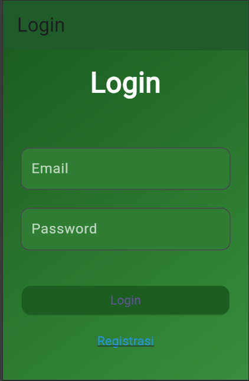

### b. Proses Autentikasi

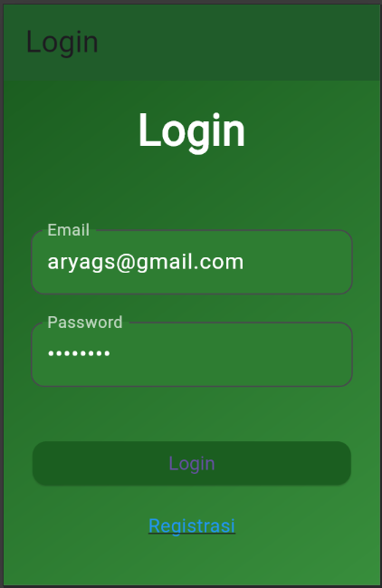

### c. Hasil Login

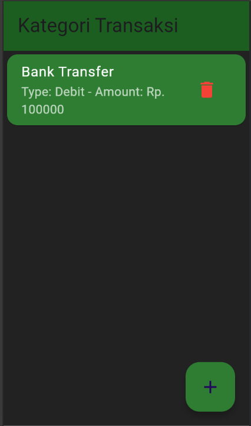
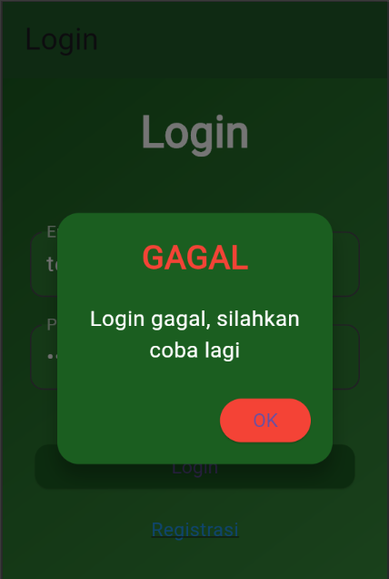

## Registrasi

### a. Mengisi Form Registrasi

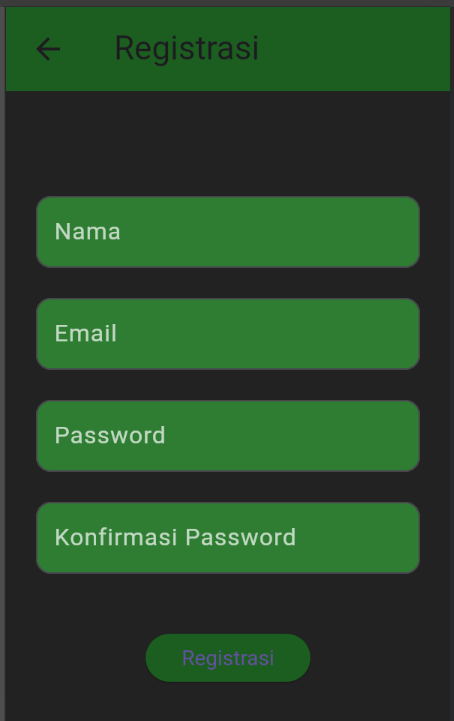

### b. Proses Pengiriman Data Registrasi

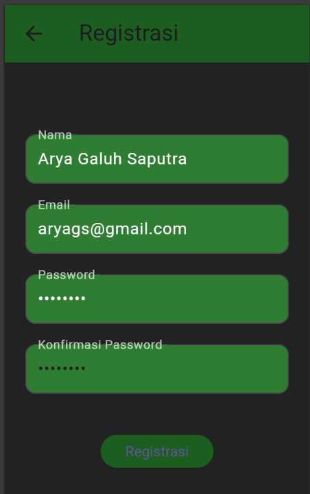

### c. Hasil Registrasi

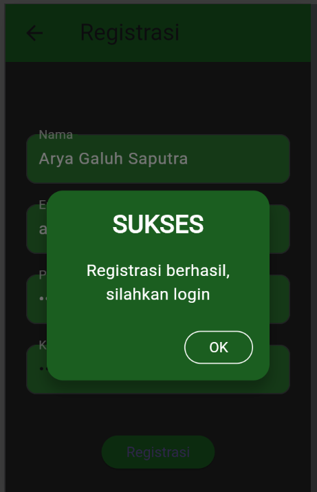

## Menampilkan Daftar Kategori Transaksi

### a. Halaman Utama Kategori Transaksi

## Menambah Kategori Transaksi Baru

### a. Membuka Form Tambah Kategori Transaksi

### b. Proses Penyimpanan Kategori Transaksi Baru

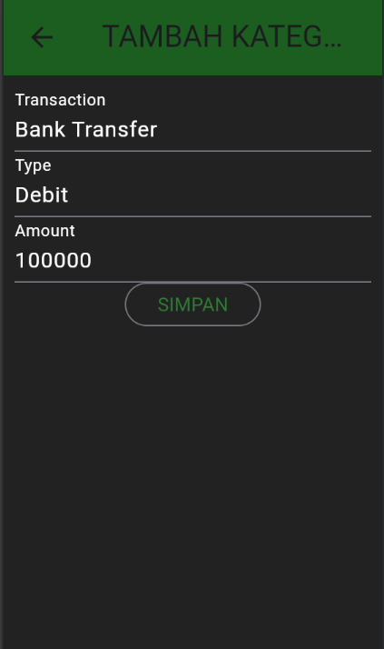

### c. Hasil Penambahan Kategori Transaksi

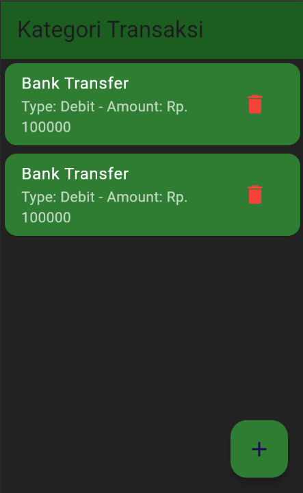
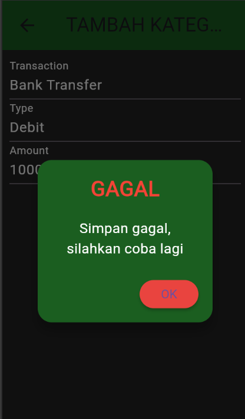

## Melihat Detail Kategori Transaksi

### a. Halaman Detail Kategori Transaksi

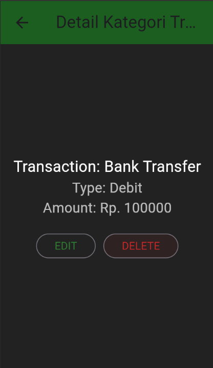

## Mengubah Kategori Transaksi

### a. Membuka Form Ubah Kategori Transaksi

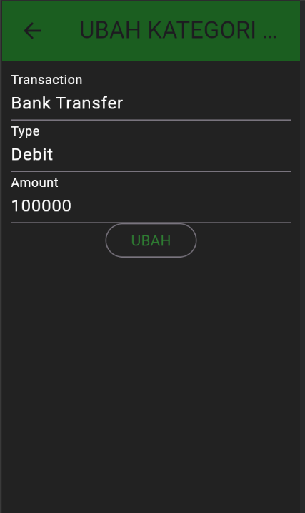

### b. Proses Penyimpanan Perubahan Data Kategori Transaksi

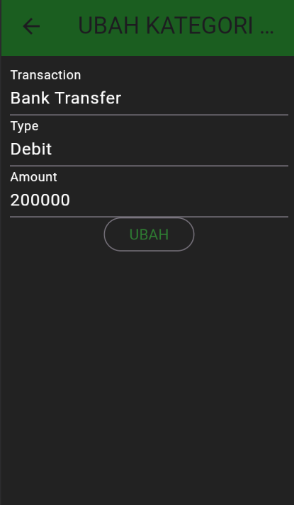

### c. Hasil Perubahan Kategori Transaksi

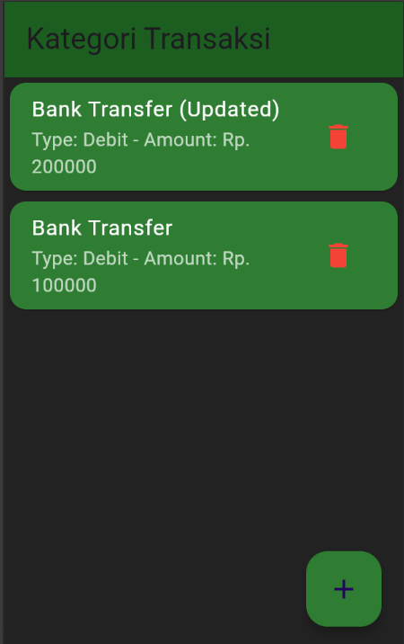

## Menghapus Kategori Transaksi

### a. Konfirmasi Penghapusan

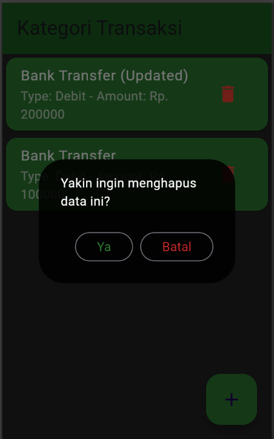

### b. Hasil Penghapusan Kategori Transaksi

