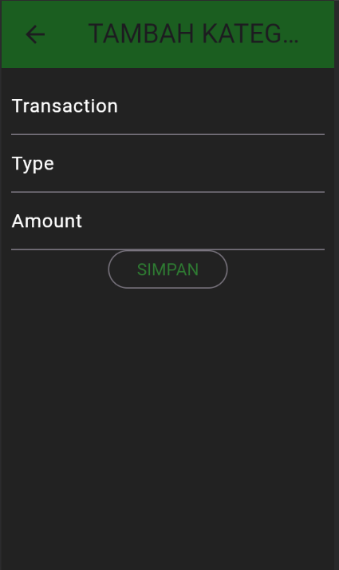
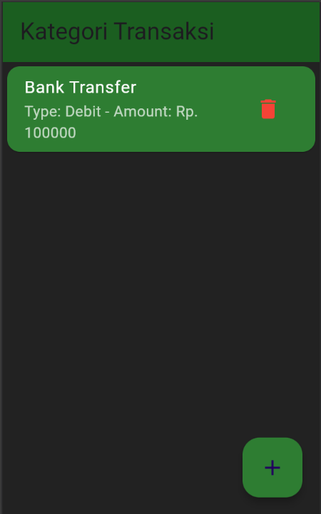

- **Nama** : Arya Galuh Saputra
- **NIM** : H1D022022
- **Shift Lama** : C
- **Shift Baru** : B

# Responsi 1 - Aplikasi Manajemen Keuangan

## Tabel Kategori Transaksi

## Login

### a. Mengisi Form Login

### b. Proses Autentikasi

### c. Hasil Login

## Registrasi

### a. Mengisi Form Registrasi

### b. Proses Pengiriman Data Registrasi

### c. Hasil Registrasi

## Menampilkan Daftar Kategori Transaksi

### a. Halaman Utama Kategori Transaksi

## Menambah Kategori Transaksi Baru

### a. Membuka Form Tambah Kategori Transaksi

### b. Proses Penyimpanan Kategori Transaksi Baru

### c. Hasil Penambahan Kategori Transaksi

## Melihat Detail Kategori Transaksi

### a. Halaman Detail Kategori Transaksi

## Mengubah Kategori Transaksi

### a. Membuka Form Ubah Kategori Transaksi

### b. Proses Penyimpanan Perubahan Data Kategori Transaksi

### c. Hasil Perubahan Kategori Transaksi

## Menghapus Kategori Transaksi

### a. Konfirmasi Penghapusan

### b. Hasil Penghapusan Kategori Transaksi

